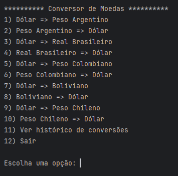

# Conversor de Moedas em Java (por [@DevHmsr](https://github.com/DevHmsr)) 💱

Este é um programa simples em Java que permite realizar conversões de diferentes moedas utilizando taxas de câmbio em tempo real. O programa oferece uma interface no terminal para que o usuário possa escolher entre diferentes opções de conversão e visualizar o valor convertido.

Além disso, ele também registra todas as conversões realizadas em arquivos de log, armazenados na pasta `logs`, com um timestamp único para cada conversão.

Este projeto foi desenvolvido como desafio proposto pela formação "Java e Orientação a Objetos G8 - ONE" da Alura.

## 🟢 Funcionalidades

- Conversão entre as seguintes moedas: USD, ARS, BRL, COP, BOB e CLP.
- Utilização de taxas de câmbio em tempo real, obtidas da API [ExchangeRate](https://www.exchangerate-api.com).
- Armazenamento das conversões realizadas em arquivos JSON, dentro da pasta [logs](./logs).
- Organização dos logs com timestamps únicos para cada conversão.
- Histórico de conversões que mostra as cinco últimas conversões realizadas.

## ⚠ Requisitos

- Java 8 ou superior.
- Conexão com a internet para obter as taxas de câmbio em tempo real via API.

## ✅ Instalação

1. Clone o repositório:
```bash
git clone https://github.com/DevHmsr/Desafio-Conversor-de-Moedas-Alura.git
cd Desafio-Conversor-de-Moedas-Alura
```
2. Certifique-se de que o Java 8 (ou superior) está instalado e configurado em seu sistema.
  
3. Crie a pasta logs, caso ela ainda não exista:
```
mkdir logs
```
4. Baixe a biblioteca [Gson](https://github.com/google/gson) (caso não use Maven/Gradle) e coloque o .jar no classpath.
   
5. Abra o projeto em seu ambiente de desenvolvimento preferido (ex.: IntelliJ, VS Code, etc.).
   
6. Compile o código: 
```
javac -cp ".:gson-2.8.9.jar" ConversorMoedas.java AssistenteInput.java ServicoConversao.java ApiTaxaConversao.java CriarJson.java MoedaResponse.java
```
7. Execute o programa:
```
java -cp ".:gson-2.8.9.jar" ConversorMoedas
```
## ⚙ Estrutura de Arquivos

- `ConversorMoedas.java:` Classe principal que controla o fluxo de execução.
  
- `AssistenteInput.java:` Lê entradas do usuário de forma segura.
  
- `ServicoConversao.java:` Realiza conversões e salva logs.
  
- `ApiTaxaConversao.java:` Obtém taxas de câmbio da API.
  
- `CriarJson.java:` Gera os arquivos JSON com os dados da conversão.
  
- `MoedaResponse.java`: Mapeia a resposta JSON da API e acessa dinamicamente as taxas de câmbio das moedas selecionadas.

## ✍ Como usar

1. Ao executar o programa, será exibido um menu no terminal com as opções de conversão de moedas.

2. Escolha uma das opções digitando o número correspondente à conversão desejada.

3. Em seguida, o programa solicitará que você digite o valor a ser convertido.

4. O valor será convertido com base nas taxas de câmbio em tempo real, e o resultado será exibido no terminal.

5. O programa também registrará o resultado da conversão em um arquivo dentro da pasta logs.

## 🖼️ Exemplo do Menu
Veja abaixo a interface do menu principal do conversor:



## 💾 Exemplo de Arquivo de Log

Após a conversão, um arquivo de log será gerado com o seguinte formato JSON:

```
{
  "valorOriginal": 100.0,
  "moedaOrigem": "USD",
  "moedaDestino": "ARS",
  "taxa": 112.35,
  "valorConvertido": 11235.0,
  "dataHora": "13/05/2025 14:22:45"
}
```
Esse arquivo será armazenado na pasta [logs](./logs).

## 🚀 Possíveis melhorias futuras

- Adicionar suporte para mais moedas.
- Criar uma interface gráfica (GUI).

## Obrigado por ler até aqui! 
Espero que esse programa seja útil para você 😁
